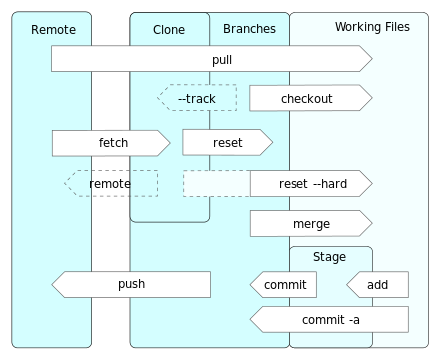

# Git Commands & GitHub

## 1. What is Git?

**Git** is a **distributed version-control system** for tracking changes in any set of files, originally designed for coordinating work among programmers cooperating on source code during software development. Its goals include speed, data integrity, and support for distributed, non-linear workflows. - [Wikipedia](https://wiki2.org/en/Git)

Simply put, Git helps users for tracking different versions of the software and easily can be reverted back between versions in case of unexpected results - instead of creating multiple copies of the files \(for each version\) multiple times and renaming them.

**Git** is the _distributed version-control system_ whereas **GitHub** is a _repository hosting service_. You need to install Git to use on your computer and it doesn't require internet connection unlike GitHub in which you own / share repositories on the web to work on your projects. 



### 1.1. Installing & Updating Git

There are multiple options to install Git to your computer. First, open a terminal and check if Git is installed already and if so find the version of Git typing the command below:

```bash
# check git version
>>> git version
git version 2.28.0 # 2nd major, 28th minor and 0th patch version
```

Since it is already install in my local computer, the command prints the version of current git install. 

If Git is already installed, you can download the latest development version via Git by cloning the git [repository](https://github.com/git/git) or simply upgrade using brew \(in MacOS in my case\).

```bash
# clone the latest repo
>>> git clone https://github.com/git/git

# or upgrade the version
>>> brew upgrade git
```

If it is your first time, you can download your preferred version of Git from [here](https://git-scm.com/downloads) and install it using the package installer. Follow the link for other options to install Git. Before moving to next section, please make sure you have a good understanding of basic linux commands. If you don't have an experience with linux, please read [Linux \| Shell Basics ](lbasic.md)section under the [Version Control](./).

### 1.1. Creating a new Git repository

Use `git init` command to initialize a new repository while you are in a folder that you desire to locate your repo. In order to make sure you are in the correct folder, you can first use `pwd` command to print your working directory, then using `cd dir_path` you can choose the folder you want to create the repo by feeding **relative** or **absolute path** of the desired directory, or create a new directory using `mkdir dir_name` after locating the desired path.

After locating the directory path, use `git init` to create an empty repository, which is ready to upload files. After you typed to command there will be a new hidden file called `.git`. Let's assume you have a new computer with no files in it, and your user name is **username**. A brand new computer \(in my case it is a Macbook\) usually comes with the folders below: 

```bash
# print working directory
>>> pwd
/Users/username

# list files inside the directory
>>> ls
Applications        Downloads         Music  
Desktop             Library           Pictures                      
Documents           Movies            Public 

# change directory to Desktop folder
>>> cd Desktop

# list files inside the Desktop folder
>>> ls
```

Since we don't have any files yet, there is no output. Now, let's create a folder called GitHub and initialize our first repo inside that directory after changing directory to that folder.

```bash
# create a new directory called GitHub
>>> mkdir GitHub

# list files inside the Desktop folder (now we have GitHub folder!)
>>> ls
GitHub

# change directory to GitHub
>> cd GitHub

# initialize your first repo. Congratulations!
>> init git
Initialized empty Git repository in /Users/username/Desktop/GitHub/.git/

# notice files starting with . are hidden
>> ls 

# to list hidden files use -a 
>> ls -a
.git
```

