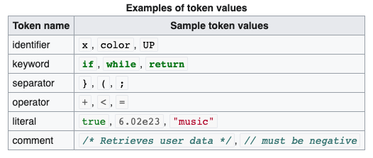

# SpaCy

## NLP using SpaCy

This is a brief summary of the NLP [course](https://www.kaggle.com/learn/natural-language-processing) given by [Kaggle](https://www.kaggle.com/). [SpaCy](https://spacy.io/) is the leading library for [NLP](https://wiki2.org/en/Natural_language_processing+Brights.4),  and one of the most popular Python frameworks. Here I will mention some of the important methods used for Natural Language Processing using SpaCy.

First, we need to specify the model we are using \(simply the language\). Here is a small snippet of loading the "English" language model.

```python
>>> import spacy
>>> nlp = spacy.load('en')
```

After loading the model, we can process a text in **English** using `nlp` variable we just defined.

```python
>>> text = nlp('The quick brown fox jumps over the lazy dog.')
```


**Notice:** The sentence above actually uses every letter in the English alphabet at least once.


Now, let me introduce some of the most common lingos used in NLP.

### 1. Tokenization

A token is a [string](https://wiki2.org/en/String_%28computer_science%29) with an assigned, identified meaning. It is structured as a pair consisting of a token name and an optional token value. The token name is a category of a [lexical](https://wiki2.org/en/Lexical_analysis) unit. Common token names are:

* [identifier](https://wiki2.org/en/Identifier_%28computer_languages%29): names the programmer chooses;
* [keyword](https://wiki2.org/en/Reserved_word): names already in the programming language;
* [separator](https://wiki2.org/en/Delimiter) \(also known as punctuators\): punctuation characters and paired-delimiters;
* [operator](https://wiki2.org/en/Operator_%28computer_programming%29): symbols that operate on arguments and produce results;
* [literal](https://wiki2.org/en/Literal_%28computer_programming%29): numeric, logical, textual, reference literals;
* [comment](https://wiki2.org/en/Comment_%28computer_programming%29): line, block.




**Note:** Simply, a **token** is a unit of text in the document.


```python
>>> for (i, token) in enumerate(text):
>>>    print(f"Token {i}: {token}")

Token 0: The
Token 1: quick
Token 2: brown
Token 3: fox
Token 4: jumps
Token 5: over
Token 6: the
Token 7: lazy
Token 8: dog
Token 9: .

# One can also create a list of tokens using list comprehension
tokens = [token for token in text]
```

### 2. Text Processing

There are preprocessing methods to improve an NLP model. One of them is **lemmatizing.** The `lemma` of a word is its base form. As an example, `jump` is the lemma of the words `jumps, jumping, jumped` , etc. In our example lemmatizing the word jumps, converts it to jump.

Removing stopwords is a common practice in NLP. A **Stopword** is a word that occurs frequently in the language while not containing useful `information`. Some of the stopwords in English are: `"the", "is", "and", "or", "but", "not", "over", etc.`

After creating a token,  we can use the attributes `lemma_` and `is_stop` , that gives the lemma of the words and if the given token is a stopword or not, respectively.

```python
>>> print("Token \t\t Lemma \t\t Stopword?")
>>> print("-"*42)
>>> for token in text:
>>>    print(f"{str(token)} \t\t {token.lemma_} \t\t {token.is_stop}")

Token 	    	   Lemma 		       Stopword?
------------------------------------------
The 		         the 		         True
quick  		   		 quick 		  		 False
brown 		  		 brown 		  		 False
fox 		    		 fox 		    		 False
jumps 		  		 jump 		  		 False
over 		    		 over 		  		 True
the 		    		 the 		    		 True
lazy 		    		 lazy 		  		 False
dog 		    		 dog 		    		 False
. 		      		 . 		      		 False
```

The lemmas and stopwords important because text data is often very noisy mixed in with informative content. In the example above, the important words are `quick`, `brown` , `fox` , `jump` , `lazy` and `dog.` Removing stop words often helps the model to hone in on relevant words. Lemmatizing also helps to reduce the model complexity by simplifying the words with the same base form. 

On the other hand, lemmatizing and dropping stopwords sometimes might worsen your model's performance. The preprocessing of a document is similar to the hyperparameter optimization process.

### 3. Pattern Matching

Matching tokens or phrases within a piece of \(or entire\) text is a common NLP task. It can be done using regular expressions, but SpaCy is a lot easier to use.

First, we will create a `Matcher`, or a `PhraseMatcher` object to match an individual token or a list of tokens, respectively. Let's create a `PhraseMatcher` object as an example:

```python
>>> from spacy.matcher import PhraseMatcher
>>> matcher = PhraseMatcher(nlp.vocab, attr = 'LOWER')

>>> word_list = ['Black', 'Brown', 'Cat', 'Dog']
>>> patterns   = [nlp(word) for word in word_list]

>>> matcher.add('TerminologyList', patterns)
>>> print(matches := matcher(text)) #using walrus operator

[(3766102292120407359, 2, 3), (3766102292120407359, 8, 9)]

>>> match_id, start, end = matches[0]
>>> print(nlp.vocab.strings[match_id], word_list[start:end])

TerminologyList ['Cat']
```

As it can be seen in the code snippet above, matcher returns a list of tuples where each tuple consists of `(match_id, start, end)` where start and end represent the beginning and ending of the string.


