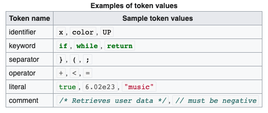
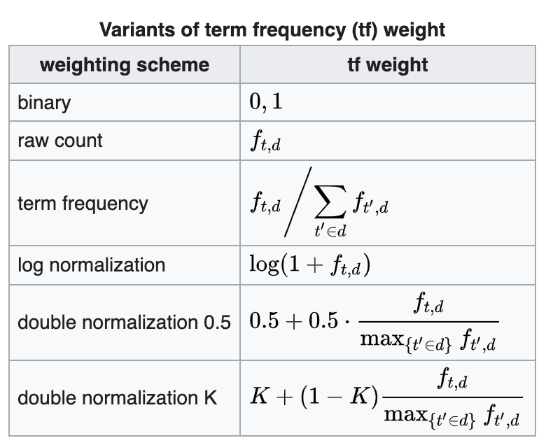
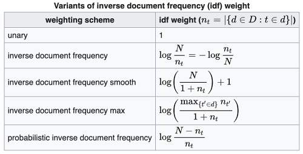

# SpaCy

## NLP using SpaCy

This is mainly a brief summary of the NLP [course](https://www.kaggle.com/learn/natural-language-processing) given by [Kaggle](https://www.kaggle.com/). But I included some other information that can be useful. [SpaCy](https://spacy.io/) is the leading library for [NLP](https://wiki2.org/en/Natural_language_processing+Brights.4),  and one of the most popular Python frameworks. Here I will mention some of the important methods used for Natural Language Processing using SpaCy.

First, we need to specify the model we are using \(simply the language\). Here is a small snippet of loading the "English" language model.

```python
>>> import spacy
>>> nlp = spacy.load('en')
```

After loading the model, we can process a text in **English** using `nlp` variable we just defined.

```python
>>> text = nlp('The quick brown fox jumps over the lazy dog.')
```


**Notice:** The sentence above actually uses every letter in the English alphabet at least once.


Now, let me introduce some of the most common lingos used in NLP.

### 1. Tokenization

A token is a [string](https://wiki2.org/en/String_%28computer_science%29) with an assigned, identified meaning. It is structured as a pair consisting of a token name and an optional token value. The token name is a category of a [lexical](https://wiki2.org/en/Lexical_analysis) unit. Common token names are:

* [identifier](https://wiki2.org/en/Identifier_%28computer_languages%29): names the programmer chooses;
* [keyword](https://wiki2.org/en/Reserved_word): names already in the programming language;
* [separator](https://wiki2.org/en/Delimiter) \(also known as punctuators\): punctuation characters and paired-delimiters;
* [operator](https://wiki2.org/en/Operator_%28computer_programming%29): symbols that operate on arguments and produce results;
* [literal](https://wiki2.org/en/Literal_%28computer_programming%29): numeric, logical, textual, reference literals;
* [comment](https://wiki2.org/en/Comment_%28computer_programming%29): line, block.




**Note:** Simply, a **token** is a unit of text in the document.


```python
>>> for (i, token) in enumerate(text):
...    print(f"Token {i}: {token}")

Token 0: The
Token 1: quick
Token 2: brown
Token 3: fox
Token 4: jumps
Token 5: over
Token 6: the
Token 7: lazy
Token 8: dog
Token 9: .

# One can also create a list of tokens using list comprehension
tokens = [token for token in text]
```

### 2. Text Processing

There are preprocessing methods to improve an NLP model. One of them is **lemmatizing.** The `lemma` of a word is its base form. As an example, `jump` is the lemma of the words `jumps, jumping, jumped` , etc. In our example lemmatizing the word jumps, converts it to jump.

Removing stopwords is a common practice in NLP. A **Stopword** is a word that occurs frequently in the language while not containing useful `information`. Some of the stopwords in English are: `"the", "is", "and", "or", "but", "not", "over", etc.`

After creating a token,  we can use the attributes `lemma_` and `is_stop` , that gives the lemma of the words and if the given token is a stopword or not, respectively.

```python
>>> print("Token \t\t Lemma \t\t Stopword?")
>>> print("-"*42)
>>> for token in text:
...    print(f"{str(token)} \t\t {token.lemma_} \t\t {token.is_stop}")

Token 	    	   Lemma 		       Stopword?
------------------------------------------
The 		         the 		         True
quick  		   		 quick 		  		 False
brown 		  		 brown 		  		 False
fox 		    		 fox 		    		 False
jumps 		  		 jump 		  		 False
over 		    		 over 		  		 True
the 		    		 the 		    		 True
lazy 		    		 lazy 		  		 False
dog 		    		 dog 		    		 False
. 		      		 . 		      		 False
```

The lemmas and stopwords important because text data is often very noisy mixed in with informative content. In the example above, the important words are `quick`, `brown` , `fox` , `jump` , `lazy` and `dog.` Removing stop words often helps the model to hone in on relevant words. Lemmatizing also helps to reduce the model complexity by simplifying the words with the same base form. 

On the other hand, lemmatizing and dropping stopwords sometimes might worsen your model's performance. The preprocessing of a document is similar to the hyperparameter optimization process.

### 3. Pattern Matching

Matching tokens or phrases within a piece of \(or entire\) text is a common NLP task. It can be done using regular expressions, but SpaCy is a lot easier to use.

First, we will create a `Matcher`, or a `PhraseMatcher` object to match an individual token or a list of tokens, respectively. Let's create a `PhraseMatcher` object as an example:

```python
>>> from spacy.matcher import PhraseMatcher
>>> matcher = PhraseMatcher(nlp.vocab, attr = 'LOWER')

>>> word_list = ['Black', 'Brown', 'Cat', 'Dog']
>>> patterns   = [nlp(word) for word in word_list]

>>> matcher.add('TerminologyList', patterns)
>>> print(matches := matcher(text)) #using walrus operator

[(3766102292120407359, 2, 3), (3766102292120407359, 8, 9)]

>>> match_id, start, end = matches[0]
>>> print(nlp.vocab.strings[match_id], word_list[start:end])

TerminologyList ['Cat']
```

As it can be seen in the code snippet above, matcher returns a list of tuples where each tuple consists of `(match_id, start, end)` where start and end represent the beginning and ending of the string.

### 4. Bag of Words

Most of the Machine learning models require numerical data. Hence, you need to transform the text to numeric values somehow.

One way to do is to use an idea similar to that of one-hot encoding. Each document can be represented as a vector of frequencies for each term in the vocabulary. The vocabulary is built from all the tokens \(terms\) in the corpus.

Consider the sentence above "The quick brown fox jumps over the lazy dog."  and "The fox bit the dog." Then the vocabulary is \(excluding punctuation\):

`{'the', 'quick' , 'brown', 'fox', 'jumps', 'over', 'lazy', 'dog', 'bit'}`

Now for each document, we will count how many times a term occurs, and place that count in the appropriate element of a vector. Notice the vocabulary has 9 elements. Then, the sentences above can be represented as $$1 × 9$$ vectors, where each column represents the frequency of the terms included in the vocabulary.

                                             $$s_1 = [\quad  2, \quad 1,  \quad 1, \quad 1, \quad 1, \quad 1, \quad 1, \quad 1, \quad 0 \quad ] \\[10pt] s_2 = [\quad  2, \quad  0, \quad  0, \quad  1, \quad  0,  \quad 0, \quad  0, \quad  1, \quad  1 \quad ]$$ 

  
Notice that `0` 's represent the missing terms in the sentences. For example,  sentence 1 doesn't include the `bit` term. This representation is called a **bag of words**. Vocabularies may have thousands of terms depending on the context, so sometimes these vectors can be very large.

Another common representation is **TF-IDF \(Term Frequency - Inverse Document Frequency\)**. Using TF-IDF can improve model performance.

### **5. TF - IDF**

**TFI - DF** is a numerical statistic that is intended to reflect how important a word is to a document in a collection or corpus. The TF-IDF value is proportional to the number of times a word appears in the document and is compensated by the number of documents in the corpus that contain the word, which helps to adjust for the fact that some words may appear more frequently. It is one of the most popular term-weighting schemes commonly used. According to Wikipedia, a survey conducted in 2015 showed that 83% of text-based recommender systems in digital libraries use TF-IDF. The formula of TF-IDF includes two different metrics:

                                            $$\text{TFI-DF} (t,d,D)= \text{TF} (t,d) × \text{IDF} (t,D) $$ 

* The **term frequency** \(TF\) of a word in a specific document. Some of its variants are:



* The **inverse document frequency** \(IDF\) of the word across a set of documents, which calculates how common \(or rare\) a term is in the entire set of documents. As IDF gets close to 0, it means that the term is more common across the documents. Some of its variants are:



Once you have the bag of words representation of your document, you can feed those vectors to any machine learning model. SpaCy's `TextCategorizer` class handles this conversion and builds a simple linear model for you.

The TextCategorizer is a **pipe,** where pipes are classes for processing and transforming tokens. When you create a spaCy model with `nlp = spacy.load('en')`, there are default pipes performing different transformations. When you run the text through a model `doc = nlp("Example text")`, the output of the pipes is attached to the tokens in the `doc` object. The lemmas for `token.lemma_` come from one of these pipes. First, we will create a model without any pipes except for a tokenizer. Then, we'll create a TextCategorizer pipe and add it to the empty model.

```python
# We already imported spacy above
# Let's create an empty model
>>> nlp = spacy.blank('en')

# Let's create the TextCategorizer w/ exclusive classes and 'bow' architecture
>>> config0 = {'exclusive_classes': True, 'architecture': 'bow'}
>>> textcat = nlp.create_pipe('textcat', config = config0)

# Let's add the TextCategorizer to the model
>>> nlp.add_pipe(textcat)

# Add labels to text classifier
>>> textcat.add_label('spam')
>>> textcat.add_label('ham')
```

In the problem above, we are modeling a binary classification problem in which classes are `spam` and `ham`; hence, the classes are **exclusive**. Finally, **bow** stands for the `bag of words` architecture**.** Here we picked a simple architecture.

### 6. Training a TextCategorizer Model

We need to convert the data labels into the form TextCategorizer requires. For example, if a text \(in an email\) is `spam` then we will create a dictionary `{'spam': True,  'ham': False}`.

```python
>>> texts = spam['text'].values
>>> labels= [{'cats': {'ham': label == 'ham', 'spam': label == 'spam'}}
               for label in spam['label']
               ]

# Let's combine the texts with labels using zip function             
>>> X_train = list(zip(texts, labels))
```

We are now ready to train our first model. First, we will create an `optimizer` object, then we will split our data into mini-batches to increase the efficiency of the model. Finally, using the`update` attribute of the model we will update the parameters.

```python
>>>> from spacy.util import minibatch

# Fix random initialize and instantiate the optimizer object
>>> spacy.util.fix_random_seed(42)
>>> opt = nlp.begin_training()

# Let's create a batch generator with given batch size
>>> batches = minibatch(X_train, size = 10)

# Let's iterate through batches and update parameters
>>> for batch in batches:
...    (texts, labels) = zip(*batch)
...    nlp.update(texts, labels, sgd = opt)
```

Notice that this is training just one loop \(epoch\) through the whole data. To get better results, we need to randomly shuffle the data and then go through it multiple times using `epoch`.

```python
>>> import random

>>> random.seed(42)                               # Fix initialization of random
>>> spacy.util.fix_random_seed(42)                # Fix initialization of spacy
>>> opt = nlp.begin_training()

>>> train_loss = {}

# Let's iterate through batches  for each epoch
>>>for epoch in range(10):
...    random.shuffle(X_train)                    # shuffle the data
...    batches = minibatch(X_train, size = 10)    # create mini-batches of data 
...        for batch in batches:                  # update variables at each batch
...            (texts, labels) = zip(*batch)
...            nlp.update(texts, labels, sgd = opt, losses = train_loss)
...    print(losses)

{'textcat': 0.4318974167265992}
{'textcat': 0.6474976181863781}
{'textcat': 0.7842154461214998}
{'textcat': 0.8716683624472470}
{'textcat': 0.9280939224368301}
{'textcat': 0.9655779806546522}
{'textcat': 0.9939651735123619}
{'textcat': 1.0127976521031560}
{'textcat': 1.0275637693323000}
{'textcat': 1.0378531328161298}
```

### 7. Making Predictions

As we trained a model, now we can make predictions using the `predict()` method. We need to be careful as the input needs to be tokenized using `nlp.tokenizer` before feeding to predictions.

```python
>>> texts = ["Are you ready for the tea party????? It's gonna be wild",
             "URGENT Reply to this message for GUARANTEED FREE TEA" ]
         
>>> docs = [nlp.tokenizer(word) for word in texts]

# Let's calculate the scores for each doc
>>> textcat = nlp.get_pipe('textcat')
>>> scores  = textcat.predict(docs)[0]

>>> print(scores)

[[9.9994397e-01 5.6023764e-05]
 [1.1491313e-02 9.8850864e-01]]
 
 >>> preds = scores.argmax(axis = 1)
 >>> print([textcat.labels[label] for label in preds]
 
 ['ham', 'spam']
```

These scores are used to predict a single class by choosing the label with the **highest probability**. The index of the highest probability is obtained using `argmax` attribute on scores, then we can use that index to get the label from `textcat.labels`.  To measure the model performance, there are multiple metrics available such as `accuracy, precision, recall, F1-score, ROC curve, AUC, etc.` ****These topics are covered in the Hands-on Machine Learning section, Chapter 3.   
****


